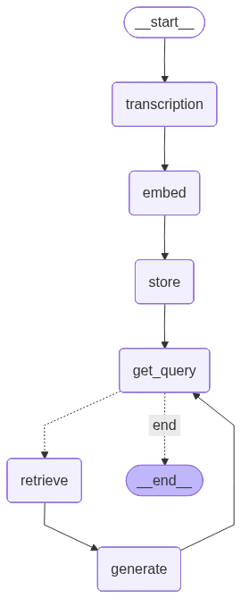

# Podcast Fact Extractor RAG
A lightweight Retrieval-Augmented-Generation (RAG) system design to extract factual insights from podcast transcripts.

---
<div style="display: flex; align-items: flex-start; gap: 20px;">

<!-- Left column: Graph image -->
<div style="flex: 1;">
  
</div>

<!-- Right column: Project overview -->
<div style="flex: 1;">
## Project Overview

This project implements a **mini RAG pipeline** to:

1. Transcribe the podcast.
2. Chunk and embed the transcript data.
3. Retrieve relevant information for a user query.
4. Generate concise, accurate answers using an LLM.

</div>
</div>
---

## Tech Stack

- **Python**
- **Langchain / HuggingFace / Sentence Transformers** - For embeddings
- **LLM (HuggingFace)** - For answer generation
- **Qdrant** - For vector storage and search
- _.Deployment (still pending)._

---

## Usage
```
# Clone the repo
git clone <repo_link>
cd podcast_fact_extractor_rag

# Install dependencies
pip install -r requirements.txt

# Run the pipeline
python -m src.agents.qna_agent
```
